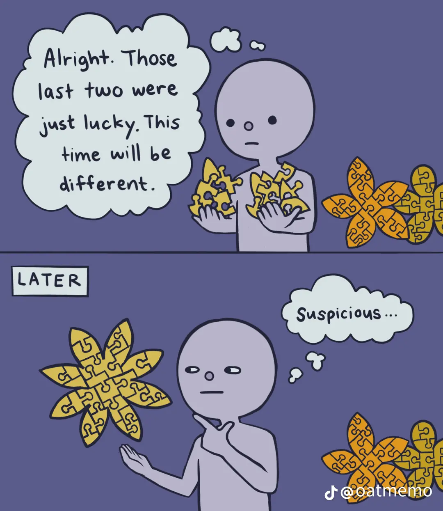

Test content 1 :)

>[!Note] Hey!
> body text

- Take Title of file and add it to `title` yaml
- add yamltitle file to creationdate+title with spaces replaced with dashes, `2022-12-04-My-Titled-Note`

Let's talk about [Test Note 2](./2022-12-05-My-Titled-Second-Note.md) and specifically [Test Note 2#First Header](Test%20Note%202#First%20Header.md).

Here's a link: [Jekyll • Simple, blog-aware, static sites](https://jekyllrb.com/docs/posts/)

Here's a note I haven't published: [2022-12-04](2022-12-04)
and some text in it:

Here's an image:

Here's an embedded image:
